<!-- hero: monochrome ASCII portrait (types in) beside a neofetch-style info
     panel. regenerate portrait: python scripts/prep_photo.py &&
     python scripts/make_ascii_svg.py ; info panel: python scripts/make_info_card.py -->
<table>
<tr>
<td valign="top"></td>
<td valign="top"></td>
</tr>
</table>

## Parzival

**ML Engineer · Software Developer · Resident of the OASIS**

 

<!-- animated contribution graph: real data, boxes reveal cell by cell
     (regenerated daily by .github/workflows/update-profile-art.yml) -->

  

I go by a handle because my code is public but the rest of me is not.
Nothing mysterious about it, I just like keeping work-me and internet-me in separate tabs.

If you found something I shipped and it did not fall over, that was the plan😁.

